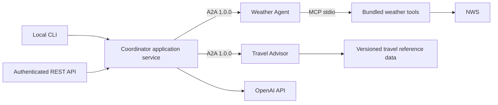
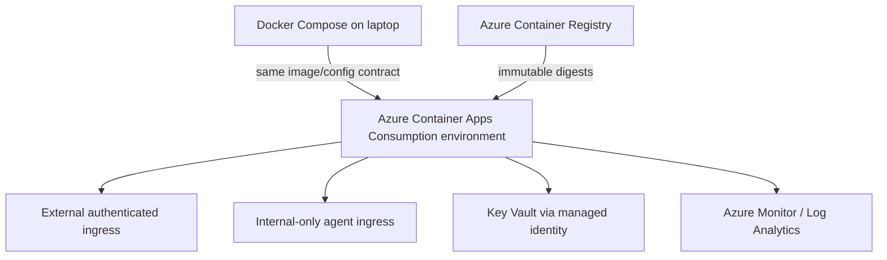
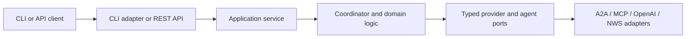

# Architecture Spine — Travel Comparator

## Design Paradigm

Coordinator-led orchestration over independently bounded domain agents. The coordinator owns workflow and synthesis; the Weather Agent owns weather and MCP access; the Travel Advisor owns travel reference data and cost/event results.

## Invariants & Rules

### AD-1 — Coordinator owns the comparison workflow [ADOPTED]

- **Binds:** Travel Comparator MVP
- **Prevents:** Multiple components running divergent negotiation, conflict-resolution, or recommendation flows.
- **Rule:** Both client adapters call one coordinator application service. It alone normalizes the request, fans out the first round in parallel, decides whether conflict follow-up is needed, and synthesizes the final response. Trigger one follow-up when any city has weather status other than `GO`, the cheapest city differs from the weather-preferred city, or an event is severe. Among cities with complete price and weather data, recommend the lowest total trip cost with `GO`; if none exist, recommend the lowest-cost `CAUTION` city with the warning, and if all are `NO_GO`, return no winner. An unresolved source failure excludes that city from the winner set. Agents return typed domain results and never invoke other agents.

### AD-2 — Protocol and tool access follow explicit boundaries

- **Binds:** Coordinator, Weather Agent, Travel Advisor, external clients
- **Prevents:** Protocol drift, untrusted dynamic service calls, or bypass of the Weather Agent's tool controls.
- **Rule:** Client-to-service uses a versioned REST API; coordinator-to-agent uses A2A 1.0.0; Weather Agent-to-weather tools uses MCP 2026-07-28 over stdio. Only configured trusted agent endpoints and explicitly allow-listed MCP tools may be called. The coordinator never calls MCP or follows user/model-provided URLs. The Weather Agent starts only the configured MCP executable with fixed arguments, no shell, reduced privileges, and no inherited provider secrets.

### AD-3 — Domain ownership is single-writer and request-scoped

- **Binds:** Coordinator, Weather Agent, Travel Advisor
- **Prevents:** Competing owners for result fields and hidden cross-agent mutable state.
- **Rule:** The Weather Agent alone owns weather results; the Travel Advisor alone owns travel cost/event results; the coordinator alone owns normalized request, conflict decisions, and final recommendation. MVP comparison state is transient; there is no shared mutable database.

### AD-4 — Local and cloud deployments use the same container contracts [ADOPTED]

- **Binds:** CLI, REST API, coordinator and worker services
- **Prevents:** Laptop-only startup behavior and production-only service addressing/configuration.
- **Rule:** Docker Compose defines local services and service-name networking; Azure Container Apps hosts the same immutable images. Only the authenticated coordinator/API has an external path; agent apps have internal ingress and must not be targets of environment-level HTTP routes, gateways, or alternate public endpoints. Validate that invariant in infrastructure and reachability tests. Keep the MVP on ACA Consumption; use scale-to-zero only while its cold-start latency is accepted.

### AD-5 — Security controls are enforced at every trust boundary [ADOPTED]

- **Binds:** All clients, agents, model/provider integrations, deployment resources
- **Prevents:** Public worker/tool access, secret leakage, arbitrary tool execution, or treating model/agent output as trusted.
- **Rule:** Cloud API callers must present a valid Microsoft Entra ID token with the configured issuer/audience and `TravelComparator.User` app role; deny by default and require explicit user assignment with no anonymous access or self-registration. Give each ACA app a distinct managed identity. Every A2A worker validates issuer, audience, expiry, and `invoke` role and authorizes only the coordinator identity. For laptop Compose, workers require a distinct local-only coordinator credential and bind no services to public interfaces; the direct CLI runs as the signed-in OS user. Validate bounded, typed input/output at every protocol boundary; allow only configured HTTPS destinations and reject unapproved redirects, user/model-controlled URLs, and private/link-local/metadata destinations. Use Key Vault with least-privilege access in Azure and ignored local secret files excluded from images and MCP subprocess environments. Require authentication and authorization tests before enabling cloud external ingress.

### AD-6 — Failures and partial results are explicit

- **Binds:** Coordinator and all provider/agent calls
- **Prevents:** Hung workflows, amplified retries, and fabricated success-shaped recommendations.
- **Rule:** Use the canonical result status `complete`, `partial`, or `failed` and error shape `{code, source, retryable, correlation_id}` across REST and A2A. Return HTTP 200 for complete/partial comparisons, 4xx for caller/authentication errors, 502 when providers return no usable comparison, and 504 when the coordinator deadline expires. A result is partial when one or more sources/cities are unavailable but at least one complete candidate remains; failed comparisons have no usable candidate. The coordinator owns one 30-second end-to-end deadline per request and propagates remaining time; permit at most one retry per call for explicitly retryable, idempotent operations, with backoff inside that deadline. Reuse an A2A task via the request idempotency key after an uncertain timeout; do not launch duplicate work. Never retry auth, validation, or other non-retryable errors, and never invent missing weather, price, or event data.

### AD-7 — Operational data is correlated and redacted

- **Binds:** REST API, coordinator, agents, deployment pipeline
- **Prevents:** Untraceable cross-agent failures or exposure of secrets and sensitive request content through telemetry.
- **Rule:** Propagate a generated server-side request/task correlation ID and emit only allow-listed service, timing, status, and error-category fields. Do not log raw request/response bodies, prompts, itinerary/location data, authorization headers, provider response/exception bodies, PAN/CVV, tokens, or secrets. Sanitize untrusted strings; configure telemetry access and retention per environment before production. Expose health/readiness endpoints without secrets.

### AD-8 — Payment scope remains outside the agent system [ADOPTED]

- **Binds:** MVP request handling, agents, model prompts, reference data, telemetry
- **Prevents:** Accidental introduction of cardholder data into model prompts, agent messages, or analytics.
- **Rule:** The MVP must not collect, process, transmit, or store PAN, expiration date, security code, track/chip, PIN/PIN block, or payment tokens. Reject structured payment fields before orchestration and apply conservative PAN detection to free text; do not rely on detection to make arbitrary payment data safe to process. If payments are later required, use provider-hosted/tokenized capture and isolate payment handling from agent services, but do not infer scope exclusion or compliance from tokenization. Require a documented end-to-end data-flow/scope review and qualified assessor/acquirer validation before design or deployment; this spine does not claim compliance.

### AD-9 — Releases are reproducible and promotable

- **Binds:** Application images, infrastructure, Azure environments
- **Prevents:** Environment-specific rebuild drift and unreviewed production changes.
- **Rule:** Lock application dependencies, validate tests/scans and infrastructure changes in CI, build and scan one immutable image per source revision, deploy by digest, provision Azure resources with Bicep, authenticate deployment automation with OIDC, and promote the same digest through isolated development and production environments with approval, smoke checks, and a rollback path. Runtime identities cannot deploy resources; deployment identities cannot read runtime provider secrets.

### AD-10 — Shared wire and configuration contracts are versioned

- **Binds:** REST API, coordinator, agents, local/cloud deployments
- **Prevents:** Independently valid implementations disagreeing on units, failure meaning, configuration names, or startup behavior.
- **Rule:** Keep one versioned schema in `contracts/` for API and A2A request/result/error payloads; validate every producer and consumer against it. Dates are ISO 8601 calendar dates; timestamps are ISO 8601 with UTC offsets; monetary amounts use integer minor units and ISO 4217 currency codes; measurements always carry explicit units. Results use only `complete`, `partial`, or `failed`; errors use `{code, source, retryable, correlation_id}`. Per-service settings use documented typed keys: `APP_ENV`, `LOG_LEVEL`, `WEATHER_AGENT_URL`, `TRAVEL_AGENT_URL`, `OPENAI_API_KEY` (coordinator only), `REQUEST_TIMEOUT_SECONDS` (30), and `MAX_CITIES` (maximum 4), with `API_PORT` defaulted only for local development. A2A audiences and local worker credentials are explicitly configured by deployment profile. Fail startup for missing/malformed required values and never silently choose a production endpoint. Changes to fields, units, enums, config keys, or semantics require an explicit schema/config version and compatibility tests.

## Consistency Conventions

| Concern | Convention |
| --- | --- |
| Naming and interfaces | Version client endpoints under `/api/v1`; use configured service names for A2A; stable, typed capability names for agents/tools. |
| Data and errors | Normalize city/date/request fields in the coordinator; canonical ISO date/offset timestamp, explicit-unit measurement, ISO-4217 minor-unit money, and shared `complete`/`partial`/`failed` result and error contracts. |
| Wire semantics | Shared API/A2A schema; ISO calendar dates and offset timestamps; explicit measurement units; integer minor units plus ISO 4217 currency; common result and error envelopes; versioned compatible changes. |
| State and ownership | Request-scoped state only in MVP; source-specific data has one owning agent; no shared mutable store. |
| Configuration and secrets | `APP_ENV`, `LOG_LEVEL`, `WEATHER_AGENT_URL`, `TRAVEL_AGENT_URL`, `OPENAI_API_KEY` (coordinator only), `REQUEST_TIMEOUT_SECONDS`, and `MAX_CITIES`; typed settings with startup validation; ignored local secret files; only coordinator identity reads OpenAI secret. Never expose secrets in images, prompts, A2A payloads, logs, or MCP subprocess environments. |
| Reliability and telemetry | One 30-second request deadline; at most one retry for safe/idempotent retryable calls; propagated idempotency key; shared result/error envelope; allow-listed redacted telemetry with production retention/access settings. |
| Deployment | Docker Compose locally; isolated ACA Consumption environments for development and production; only coordinator/API external; worker apps excluded from all public routes; per-app workload authorization; immutable image digest gated by tests/approval and reversible rollout. |

## Stack

| Name | Version |
| --- | --- |
| Python | 3.14.x |
| FastAPI | 0.142.2 (candidate as of 2026-10-03; verify compatibility and lock before implementation) |
| Agent2Agent (A2A) protocol | 1.0.0 |
| Model Context Protocol (MCP) | 2026-07-28 |
| Docker Compose | 2.x |
| Azure Container Apps | Consumption plan (managed platform) |

## Structural Seed

## Deferred

- Numeric SLOs, capacity, latency targets, replica bounds, and alert thresholds; settle before production traffic using measured load/cold-start data.
- Production user sign-in experience, onboarding/role assignment, public edge/WAF choice, and network-level egress enforcement; the deny-by-default app role, HTTPS, API limits, destination allow-list, and no-public-worker rules above are mandatory meanwhile.
- Exact Python patch/base-image digest and FastAPI-compatible lockfile; pin after testing the chosen A2A and provider SDKs against the maintained runtime.
- Provider retention, training, and data-processing settings/terms; confirm and record before production.
- Persistent history, tenant isolation, durable workflow state, and database technology; revisit only when product requirements require retention or async recovery.
- Azure region, private endpoints, advanced network segmentation, and a higher-control hosting platform; revisit for residency, threat-model, or organizational constraints.
- Payment implementation and PCI DSS scope/assessment; do not enable payment handling until a formal review defines obligations.
