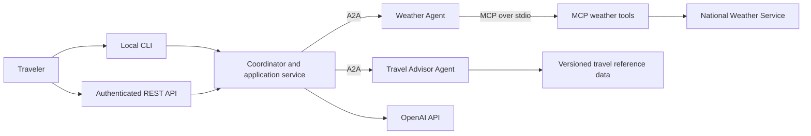
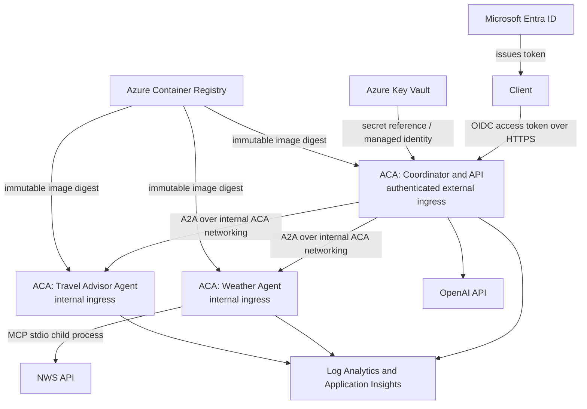

# Travel Comparator — Architecture

**Document type:** Target architecture and implementation contract
**Status:** Architecture defined; a local runnable implementation and ACA/Bicep deployment pipeline are present. A live Azure deployment has not been performed.
**Last updated:** 2026-10-03

This document records the implementation contract and how to operate the Travel Comparator as a cost-conscious MVP. Local application controls and Azure deployment templates are implemented, but local Docker smoke tests and live Azure rollout have not been performed. The document also records the boundaries to preserve if payment capabilities are introduced later; the system is not PCI DSS compliant.

The current product behavior and demo sequence are in [Travel_Comparator_execution_steps.md](./Travel_Comparator_execution_steps.md). The concise, enforceable architecture spine is in [ARCHITECTURE-SPINE.md](./_bmad-output/planning-artifacts/architecture/architecture-multi-agent-2026-10-03/ARCHITECTURE-SPINE.md).

## Runnable implementation

The application is Python 3.14, managed with `uv`. Its REST API and CLI share the same request-scoped coordinator; the coordinator calls private A2A Weather and Travel Advisor workers. The weather worker owns its MCP-over-stdio child. Local Compose defaults to deterministic stubs and publishes only the API on `127.0.0.1:8080`.

### Run locally

Prerequisites: Python 3.14, `uv`, and Docker Compose. From the repository root:

```powershell
Copy-Item .env.example .env
# Edit .env: set two different random local tokens, each at least 24 characters.
docker compose --env-file .env -f deploy/compose.yaml up --build -d
docker compose --env-file .env -f deploy/compose.yaml ps
```

The default `STUB_PROVIDERS=true` mode needs no cloud identity, OpenAI key, or live-provider access. Run the CLI in the API container:

```powershell
docker compose --env-file .env -f deploy/compose.yaml exec api travel-comparator "Compare Austin, Miami, and Denver for a 5-day trip from New York"
```

Or submit the canonical v1 request to the local API:

```powershell
$body = '{"origin":"New York","destinations":["Denver","Austin","Miami"],"duration_days":5}'
$env:LOCAL_API_TOKEN = '<same local API token as .env>'
Invoke-RestMethod -Uri http://127.0.0.1:8080/api/v1/comparisons `
  -Method Post -ContentType application/json `
  -Headers @{ Authorization = "Bearer $env:LOCAL_API_TOKEN" } -Body $body
```

The local token must match `LOCAL_API_TOKEN` in `.env`. `GET /health/live` and `GET /health/ready` are also available. Stop the stack with `docker compose --env-file .env -f deploy/compose.yaml down`.

### Data and provider limits

- Stub mode is deterministic for tests and local demos. With `STUB_PROVIDERS=false`, weather comes from the National Weather Service; outbound access to `api.weather.gov` and a real operator contact in `NWS_USER_AGENT` are required. A requested departure date uses that date's daytime forecast; if it is outside the returned forecast window, weather is reported unavailable rather than substituting today's forecast.
- The travel reference data is illustrative, not a live fare/hotel search and not bookable. Every synthetic amount is labelled as such. The documented five-day NYC sample totals remain Denver **$900**, Austin **$1,030**, and Miami **$1,665**.
- Live-mode comparison narrative and natural-language CLI parsing require an OpenAI API key. For local use, keep it only in `.env`; in Azure it is resolved by the API container from the configured Key Vault secret. Do not put credentials in request bodies, source files, or logs.
- No payment-card data is accepted. The service is not PCI DSS certified or a payment system.

### Azure deployment

The Bicep templates and GitHub Actions workflows are in `deploy/bicep/` and `.github/workflows/`. CI tests, lints, audits dependencies, validates Compose, starts the Compose stack for an API-readiness/CLI smoke test, and compiles Bicep. The development workflow builds/scans an image, publishes an SBOM, pushes to ACR, resolves the pushed digest, and deploys by digest. Production promotion verifies the successful development run's artifact, rescans and deploys the same image digest only after the `production` GitHub Environment's configured approval gates.

Configure protected `development` and `production` GitHub Environments and their environment variables before enabling deployment. Required variables are `AZURE_CLIENT_ID`, `AZURE_TENANT_ID`, `AZURE_SUBSCRIPTION_ID`, `AZURE_RESOURCE_GROUP`, `NAME_PREFIX`, `ACR_NAME`, `ACA_ENVIRONMENT_NAME`, `KEY_VAULT_NAME`, `OPENAI_SECRET_URI`, `OIDC_ISSUER`, `OIDC_JWKS_URL`, `NWS_USER_AGENT`, `USER_API_AUDIENCE`, `WEATHER_A2A_AUDIENCE`, and `TRAVEL_A2A_AUDIENCE`. Use a lowercase alphanumeric/hyphen `NAME_PREFIX` (3–10 characters, starts with a letter, ends alphanumeric) and globally unique lowercase alphanumeric ACR name (5–50 characters). The ACR and Key Vault must be in the deployment resource group. Configure Azure federated credentials for the GitHub repository/environment subjects and grant the deployment principal only the resource-group permissions needed to provision the foundation, role assignments, and Container Apps.

Pre-provision a Key Vault with **RBAC authorization enabled** and a versioned OpenAI secret URI. The deployment creates distinct API, Weather Agent, and Travel Advisor user-assigned identities. Entra app registrations, audiences, the `TravelComparator.User` API role, each worker's `invoke` role, and approved user/group assignments are external prerequisites; grant the coordinator identities `invoke` on both worker APIs. The API identity receives Key Vault Secrets User and ACR pull; workers receive ACR pull only. Allow outbound NWS/OpenAI access as applicable. Set required reviewers/branch restrictions on production in GitHub; the workflow cannot configure those repository controls for you.

The API rate limit, response idempotency cache, and agent task cache are bounded in-process memory; they are not shared across replicas and are lost on restart/scale-to-zero. After successful development deployment, use the reported digest and development run ID as the `image_digest` and `development_run_id` inputs when manually running **Promote production** on `main`. The workflow checks the run succeeded and verifies its artifact contains that exact digest before promotion. Re-run it with an earlier successful development digest/run ID to roll back. The local Compose smoke test runs in CI; an actual Azure deployment still needs to be run in an Azure-enabled environment.

## 1. Architecture at a glance

Use an **orchestrated service architecture**. The coordinator owns the trip-comparison workflow and final recommendation. Weather and Travel Advisor agents own their respective domains and are independently callable. The coordinator requests first-round work concurrently, asks for follow-up only when results conflict, and synthesizes a final response from validated agent results.



### Responsibilities and ownership

| Component | Owns | Must not own |
| --- | --- | --- |
| CLI adapter | Local interactive input/output; calls the application service | Comparison rules, agent protocol implementations |
| REST API | Versioned request/response boundary, authentication, input validation, health endpoints | Agent business logic or direct tool access |
| Coordinator/application service | Query normalization, agent discovery from configured trusted endpoints, parallel fan-out, conflict detection, follow-up, final synthesis | Weather/travel source internals, direct MCP calls, persistent shared state |
| Weather Agent | Weather interpretation and weather-source access | Travel prices, final destination selection |
| MCP weather process | Explicitly allow-listed weather tools and NWS access | Public client ingress or arbitrary tool execution |
| Travel Advisor Agent | Flight/hotel/event comparison using versioned reference data | Weather judgments or coordinator workflow |

The Weather Agent owns its MCP client and starts the weather MCP server as a child process over stdio; that process is packaged with the Weather Agent for deployment. The coordinator never connects directly to MCP.

## 2. Decisions and alternatives

| Area | Chosen direction | Trade-off / when to revisit |
| --- | --- | --- |
| Workflow shape | Coordinator-led orchestration with separate domain agents | Easier to reason about than peer-to-peer negotiation; introduce choreography only if independent agents must initiate workflows. |
| Local/cloud runtime | Docker Compose locally; Azure Container Apps (ACA) Consumption plan, scaling to zero until measured objectives require warm replicas | AKS is deferred unless Kubernetes control, add-ons, or organizational standards justify its operating cost. |
| Client interfaces | Keep the local CLI and add an authenticated, versioned REST API for cloud access; both call the same application service | Requires an HTTP/API surface in addition to the current interactive runbook. Do not deploy an interactive terminal as the production interface. |
| Model provider | Preserve the existing OpenAI API integration | Keep provider settings behind configuration; Azure OpenAI is a future option, not an implicit MVP migration. |
| State | No shared database for the MVP; travel reference data is versioned with the application; comparison state is request-scoped | Add persistence only when history, user accounts, tenancy, or durable workflows become product requirements. |
| PCI direction | Do not collect, process, transmit, or store cardholder data in the MVP | Future payment support must use a payment provider's hosted/tokenized capture and undergo formal scope/compliance assessment before handling payment flows. This architecture does not confer PCI DSS compliance. |

## 3. Request and agent contracts

### Client API

Expose the comparison operation under a versioned route such as `POST /api/v1/comparisons`. The API accepts a bounded, schema-validated trip request and returns a structured result with normalized cities, source results, any unavailable sources, and the recommendation. Keep the CLI as a thin local adapter over the same application-service interface.

Provide separate liveness and readiness endpoints. Liveness reports whether the process can run; readiness reports whether it can accept work (including required startup dependencies). Neither endpoint returns secrets or provider diagnostics. Authenticate every non-local deployment using a configured OIDC issuer/audience. Require the `TravelComparator.User` application role and deny access by default; provision approved users explicitly, with no anonymous access or self-registration. Local development binds to loopback and may use an explicit development auth profile. Authentication must never be disabled by a production configuration.

Use the same typed configuration contract across Compose and Azure. Required settings are `APP_ENV` (`local`, `development`, or `production`), `LOG_LEVEL`, `WEATHER_AGENT_URL`, `TRAVEL_AGENT_URL`, `OPENAI_API_KEY` (coordinator only), and `REQUEST_TIMEOUT_SECONDS` (integer, 30 for the MVP). `API_PORT` is an integer with a development-only default; `MAX_CITIES` is an integer capped at 4, matching the documented comparison scenarios. A2A audiences and local worker credentials are required for their respective deployment profiles. Fail startup when required settings are absent or malformed; no production endpoint or credential has a permissive default.

### Agent and tool boundaries

- Use **A2A 1.0.0** for coordinator-to-agent task exchange and capability discovery. Configure trusted worker service names/addresses from deployment configuration; never fetch or call arbitrary agent URLs supplied in user text or Agent Cards. In Azure, each app has a distinct managed identity; worker APIs validate the caller token's issuer, audience, expiry, and `invoke` role, and authorize only the coordinator identity.
- Use **MCP specification 2026-07-28** between the Weather Agent and its bundled weather-tool process. Expose only the named weather operations required by the application.
- Treat all user text, agent responses, Agent Cards, external data, and model output as untrusted. Validate protocol and domain schemas at each boundary; do not execute model-generated code or tool names.
- Keep one versioned canonical schema under `contracts/` for API and A2A requests, results, and errors. Dates use ISO 8601 calendar dates; timestamps use ISO 8601 with UTC offsets; money uses integer minor units plus an ISO 4217 currency; measurements carry explicit units. Standardize errors as `{code, source, retryable, correlation_id}`. Return `complete`, `partial`, or `failed` status consistently.
- Never let an agent silently turn missing data into a favorable result. If a source fails, either return a clearly marked partial comparison or fail the request according to the API contract; never fabricate prices, weather, or events.
- Follow-up is required when any city has weather status other than `GO`, the cheapest city differs from the weather-preferred city, or an event is severe. Among cities with complete prices and weather, recommend the lowest-cost `GO` city; if none exist, recommend the lowest-cost `CAUTION` city with the warning; if all are `NO_GO`, return no winner. Exclude cities with unresolved required-source failures.
- The coordinator owns a 30-second end-to-end deadline. Propagate remaining time to workers; permit at most one retry for explicitly retryable, idempotent operations with backoff inside that deadline. Reuse A2A work via a request idempotency key after uncertain completion; never launch duplicate work or retry authentication/validation errors.
- Return HTTP 200 for complete or partial comparisons, 4xx for caller/authentication errors, 502 when providers return no usable comparison, and 504 when the coordinator deadline expires. Agents use the same result/error envelope and map A2A task outcomes consistently.

## 4. Implemented project structure

The main code and runtime boundaries are:

```text
src/travel_comparator/
  api/                 # authenticated versioned REST API
  cli/                 # local adapter over the coordinator
  application/         # parallel fan-out, follow-up, deterministic recommendation
  contracts/           # canonical v1 API/A2A domain schemas
  agents/              # Weather and Travel Advisor A2A workers
  providers/nws/        # weather MCP stdio server and NWS client
  providers/openai/     # natural-language parser and narrative adapter
data/travel_data.json   # illustrative, versioned travel estimates
tests/                  # unit, contract, integration, end-to-end, and deployment checks
deploy/compose.yaml     # loopback API and private local workers
deploy/bicep/           # ACA, ACR, identity, and Key Vault role assignments
.github/workflows/      # CI, development deploy, production promotion
```

Keep dependencies flowing inward: adapters depend on application/domain contracts; domain logic does not depend on FastAPI, Azure SDKs, the OpenAI SDK, or transport frameworks. Document typed per-service configuration keys, required/optional settings, local/cloud endpoint mappings, and startup validation. Fail startup when required values are missing; never silently choose a production endpoint. Do not add a shared database or message broker until durable or asynchronous business requirements require one.

## 5. Local development and test architecture

The laptop environment is the first supported deployment target. The services run through Docker Compose so service names, ports, startup order, and environment configuration match the cloud topology as closely as practical.

**Local workflow** (full commands are in [Travel_Comparator_execution_steps.md](./Travel_Comparator_execution_steps.md)):

1. Install Python 3.14.x, `uv`, and Docker Engine/Compose.
2. Copy `.env.example` to `.env`, replace the two local credentials with distinct random values of at least 24 characters, and keep `.env` out of source control.
3. Start API and workers with `docker compose --env-file .env -f deploy/compose.yaml up --build`; the default `STUB_PROVIDERS=true` mode needs no live credentials.
4. Run unit, contract, and integration tests without external credentials. The MCP subprocess test and API integration tests use deterministic fixtures.
5. Smoke-test the API and CLI, then stop with `docker compose --env-file .env -f deploy/compose.yaml down`. Do not place secrets in request data, logs, or committed fixtures.

Runtime dependencies are pinned in `pyproject.toml` and `uv.lock`. The Docker image is built once for each development deployment; the pipeline records and deploys its registry digest instead of a mutable tag. Provider clients are behind narrow adapters so automated tests do not need live services. The actual Docker/Compose startup still needs validation on a Docker-enabled host.

### Required test layers

| Layer | Required coverage |
| --- | --- |
| Unit | Query parsing/validation, conflict detection, pricing/event calculations, synthesis input shaping, timeout/error handling |
| Contract | A2A Agent Cards and task payloads, MCP tool input/output, API request/response schemas, compatibility fixtures |
| Integration | API behavior, Weather Agent-to-MCP stdio lifecycle, provider behavior with stubs; Compose startup is an operator smoke check |
| End-to-end | API -> A2A worker -> MCP stub multi-city comparison; verify deterministic totals and source provenance |
| Security/release | Dependency and container scanning, input-size/rate limits, auth-negative tests, SBOM generation |
| Resilience | Worker timeout/unavailability, model API throttling, malformed agent/model output, graceful shutdown, bounded retry behavior |

Live integration tests must be separately selected and must not be a prerequisite for deterministic pull-request checks.

## 6. Security, privacy, and reliability baseline

### MVP security controls

- **Identity and access:** Require the `TravelComparator.User` Entra ID application role for cloud callers, assigned explicitly; deny anonymous access and self-registration. Each Container App uses a distinct managed identity; A2A workers validate issuer, audience, expiry, and the `invoke` role and authorize only the coordinator identity.
- **Local trust:** Run the direct CLI as the developer's signed-in OS user. Bind the API to loopback in laptop mode; Compose workers require a distinct local-only coordinator credential. Never reuse local credentials in Azure, include secret files in images, or pass provider credentials to the MCP child process.
- **Ingress:** Only the coordinator/API app may have external ingress. Worker apps use internal ingress and must not be targets of environment-level HTTP routes, gateways, or alternate public endpoints. Bicep source checks and deployment smoke steps verify the configured ingress flags; an external reachability test remains an Azure rollout prerequisite.
- **Secrets:** `.env`/local secret files are ignored by Git and created from examples with placeholders only. Store the OpenAI credential in Key Vault; only the coordinator identity may read it. Use managed identity, rotate provider credentials, and never put secrets in prompts, A2A payloads, logs, image layers, or MCP subprocess environments.
- **Input and agent safety:** Bound request sizes, validate city/date values and schemas, reject unsupported tool requests, and treat prompt instructions and agent output as untrusted data. Worker URLs are configured by deployment rather than user text; network-level egress allowlisting and private/link-local/metadata address blocking remain pre-production work.
- **Provider data minimization:** Send OpenAI only the normalized trip fields needed to generate the recommendation. Do not send secrets, payment data, or unnecessary personal data to OpenAI or other third parties. Do not log full prompts or responses; confirm provider retention, training, and data-processing terms before production.
- **Egress:** Restrict application clients to configured HTTPS provider hosts: coordinator to OpenAI, Weather Agent to NWS, and no provider egress from the Travel Advisor. Enforce the destination allow-list in code/configuration, validate TLS certificates, block private/link-local/metadata addresses, and reject redirects to unapproved hosts. Choose network-level egress enforcement before production and account for its cost.
- **Transport and exposure:** HTTPS at public ingress; workers have internal-only ingress; no debug interface or MCP endpoint is public.
- **Telemetry:** Propagate a generated server-side request/task ID. Current logs emit bounded service/error-category fields and do not log request/response bodies, prompts, itinerary/location fields, authorization headers, provider exception bodies, PAN/CVV, payment tokens, or secrets. Metrics/traces, duration/latency monitoring, and production retention/access policies remain to be configured.
- **Abuse and spend controls:** Enforce caller rate limits, request/time limits, maximum city count, bounded parallelism, retry budgets, and OpenAI token/cost budgets. The implementation applies a 60-request/minute per-principal in-process limit, request-size/deadline limits, max four cities, and bounded worker concurrency. Cross-replica/shared quotas, OpenAI token or spend budgets, and operator alerts are not implemented; configure these before production.
- **Supply chain:** Lock dependencies, scan source/dependencies/images, generate an SBOM, and deploy immutable reviewed image digests.

### Reliability behavior

Every outbound request has a deadline and bounded retries with backoff for retryable failures. Do not blindly retry non-idempotent work. Limit parallel fan-out to validated input counts. Expose health/readiness checks and graceful shutdown. Return explicit per-agent failure information; partial results must be visibly incomplete. Record and monitor request latency, failure rate, timeout rate, agent availability, model-token usage, and estimated provider spend. Define numeric SLOs and alert thresholds before production; none are specified by the current requirements.

### PCI DSS future readiness (not compliance)

**MVP boundary:** The comparator has no payment capability and must not accept or retain PAN, expiration date, security code, track/chip, PIN/PIN block, or payment tokens. Reject structured payment fields before orchestration and apply conservative PAN detection to free text; detection is best-effort and does not make arbitrary payment data safe to process. Never place payment data in prompts, agent messages, reference files, logs, traces, analytics, or support exports. Do not build a card-number field or payment-data store.

**If payment is added later:**

1. Prefer provider-hosted payment pages/fields and tokenization so the application receives only provider tokens and non-sensitive status metadata; never handle CVV.
2. Put payment orchestration and provider webhooks behind a separately reviewed boundary. Keep card-entry components, payment secrets, and payment logs outside the agent workflow.
3. Hosted/tokenized capture does not by itself determine PCI DSS scope or establish compliance. Reassess the complete data flow, network segmentation, identity, logging, retention, vulnerability management, incident response, and evidence requirements against the then-current standard before payment design or deployment.
4. Confirm scope and validation requirements with a qualified PCI assessor/acquirer; complete the required independent assessment and remediation.

This is a design direction for reducing future scope, not an attestation, certification, guarantee of reduced scope, or substitute for a formal PCI DSS assessment.

## 7. Azure deployment topology

Deploy the same immutable application images built and tested from the local project. Start with one Azure Container Apps environment on the Consumption plan:



| Resource / boundary | MVP deployment rule |
| --- | --- |
| Azure Container Apps environment | Separate isolated environments for development and production; use the Consumption plan initially. Keep resource names, settings, and limits in infrastructure-as-code. |
| Coordinator/API app | Only app with external ingress. Require OIDC authentication and the `TravelComparator.User` role; enforce request-size and rate limits at the API boundary. |
| Weather and Travel Advisor apps | Internal ingress only; never route them through an environment-level public HTTP route. Validate A2A access tokens and allow only the coordinator's managed identity with the `invoke` role. |
| Container registry | Store scanned images; deploy by immutable digest, not mutable `latest` tags. |
| Secrets | Store the OpenAI credential in Key Vault; grant read access only to the coordinator managed identity. Never bake secrets into images or Bicep parameters. |
| Telemetry | Send structured logs, metrics, and traces to Azure Monitor/Log Analytics. Apply retention and access controls; redact sensitive values before export. |
| Network egress | Allow only configured HTTPS destinations: coordinator to OpenAI, Weather Agent to NWS, and Travel Advisor to none. Review provider domains and implement network-level egress enforcement before production. |
| Configuration | Keep non-secret configuration separate from secrets. Use distinct development and production identities, secrets, and data. |

The Bicep templates set scale-to-zero with a maximum of three replicas for each app. Before production, decide latency/availability objectives and set a minimum replica if the cold-start behavior conflicts with them. The per-instance API idempotency/rate-limit caches are bounded and reset when replicas stop; a shared store would be required if global/durable semantics become necessary. Add budgets/alerts and model-token caps before exposing the API; do not assume scaling limits alone cap provider charges.

### Build, deploy, and rollback

1. Pull requests run formatting/linting, unit and contract tests, authentication-negative tests, secret/dependency checks, infrastructure validation, and a check that no worker route is public.
2. A protected main-branch workflow builds each container once, scans it, produces an SBOM, and pushes a content-addressed image to ACR.
3. GitHub Actions authenticates to Azure using workload identity federation/OIDC; no long-lived cloud deployment secret is stored in repository settings.
4. Bicep provisions the ACA environment and supporting resources. Deploy the exact image digest to a development environment and run smoke/health checks.
5. Promote the same digest to production only after explicit approval and environment-specific checks. Require passing authentication/authorization tests before external ingress is enabled. Use ACA revisions/traffic shifting for controlled rollout and rollback to a known-good revision.
6. Restrict production deployment permissions; audit deployment identity and configuration changes. Validate that only the coordinator has external ingress and that no environment-level route can target a worker.

Keep infrastructure changes reviewable and repeatable. Avoid manual-only portal configuration for resources, identity permissions, network boundaries, or secrets.

## 8. Data ownership and retention

The MVP has no shared database. `travel_data.json` (or its replacement reference dataset) is owned by the Travel Advisor and versioned/reviewed with the application. Weather results are owned by the Weather Agent and sourced from NWS. Comparison requests and results are transient and request-scoped; do not add persistent user history without an explicit retention, privacy, tenancy, and deletion design.

Each result should identify its source and relevant freshness/time window. Keep source data separate from model-generated wording so the final response can be checked against structured evidence. External API outages or stale reference data must be represented as such.

## 9. Delivery sequence and open decisions

1. **Implemented:** Python application, locked dependencies, canonical schemas, coordinator, workers, API/CLI, and deterministic unit/contract/integration tests.
2. **Implemented:** Docker image, Compose topology, Bicep infrastructure, and CI/development/production digest-based workflow definitions.
3. **Still required:** Run local Compose build/start/readiness smoke tests on a Docker-enabled host.
4. **Still required:** Provision Entra app roles/assignments, GitHub OIDC federations/environments, Key Vault, network egress controls, and deploy/test Azure development; then approve production promotion.
5. **Before production:** Measure real latency/cost; set SLOs, global quotas, token budgets, replica/retention bounds, alerting, and network-egress policies.
6. Before any payment feature, obtain a payment/data-flow design and qualified PCI scope assessment.

Decisions intentionally left to implementation/product discovery: exact client sign-in journey and any roles beyond `TravelComparator.User`; production SLOs and load; Azure region and network/private-endpoint requirements; network-level egress design and cost; operational retention/alert thresholds; commercial data-provider licensing/freshness; and any future payment scope. Do not treat these as already resolved.

## 10. Verified technology references

- [A2A Protocol Specification](https://a2a-protocol.org/latest/specification/) — current released version 1.0.0 at the time of architecture.
- [Model Context Protocol Specification](https://modelcontextprotocol.io/specification/) — specification served as version 2026-07-28 at the time of architecture.
- [Azure Container Apps overview](https://learn.microsoft.com/en-us/azure/container-apps/overview), [scaling](https://learn.microsoft.com/en-us/azure/container-apps/scale-app), [service communication](https://learn.microsoft.com/en-us/azure/container-apps/connect-apps), [ingress](https://learn.microsoft.com/en-us/azure/container-apps/ingress-overview), [managed identities](https://learn.microsoft.com/en-us/azure/container-apps/managed-identity), and [secrets](https://learn.microsoft.com/en-us/azure/container-apps/manage-secrets).
- [FastAPI release notes](https://fastapi.tiangolo.com/release-notes/) and [PyPI project](https://pypi.org/project/fastapi/). FastAPI and provider dependencies are pinned in `pyproject.toml`/`uv.lock`; revalidate compatibility when upgrading.
- [Python version status](https://devguide.python.org/versions/) — Python 3.14 is the project runtime; the CI, lockfile, and container must be kept aligned when upgrading.
- [PCI Security Standards Council document library](https://www.pcisecuritystandards.org/document_library/). Use the current official standard and applicable validation documents when payment scope is defined.
